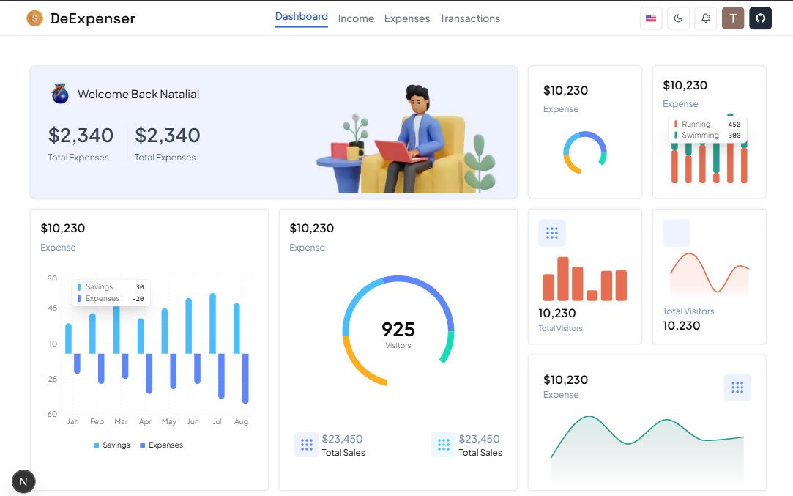

# Expense Tracker 💸

[](https://react.dev/)
[](https://nextjs.org/)
[](https://firebase.google.com/)
[](https://opensource.org/licenses/MIT)

A modern expense tracking web application built with Next.js and Firebase, designed to help users manage their finances effectively.



## Features ✨

### 🔐 Authentication
- Secure user registration/login with Firebase Authentication
- Email/password and Google sign-in options
- Session management with JWT tokens

### 💰 Expense Management
- Add expenses with category, amount, date, and description
- Edit/Delete existing transactions
- Real-time updates using Firestore
- Monthly expenditure calculation
- Daily spending limits with alerts

### 📊 Financial Insights
- Interactive monthly breakdown chart
- Category-wise spending distribution (Pie chart)
- Comparative analysis with previous months
- Exportable financial reports (CSV/PDF)

### ⚙️ User Preferences
- Customizable expense categories
- Currency preferences (USD, EUR, INR, etc.)
- Dark/Light theme toggle
- Profile management

## Tech Stack 🛠️

- **Frontend**:
  - Next.js 14 (App Router)
  - React 18
  - Tailwind CSS + Shadcn UI Components
  - Recharts (Data Visualization)

- **Backend**:
  - Firebase Authentication
  - Firestore Database
  - Firebase Cloud Functions
  - Firebase Hosting

- **Utilities**:
  - Zod (Schema Validation)
  - React Hook Form
  - date-fns (Date Management)
  - Vercel Analytics

## Installation ⚡

1. Clone the repository
```bash
git clone https://github.com/devalentineomonya/NextJs-Firebase-Expense-Tracker.git
cd NextJs-Firebase-Expense-Tracker
```

2. Install dependencies
```bash
npm install

```

3. Set up Firebase configuration
```bash
cp .env.local.example .env.local
```

4. Add your Firebase credentials in `.env.local`
```env
NEXT_PUBLIC_FIREBASE_API_KEY=your_api_key
NEXT_PUBLIC_FIREBASE_AUTH_DOMAIN=your_auth_domain
NEXT_PUBLIC_FIREBASE_PROJECT_ID=your_project_id
...
```

5. Deploy the firestore rules
```bash
firebase deploy --only firestore:rules
```

6. Run the development server
```bash
npm run dev
```

## Configuration 🔧

### Firebase Setup
1. Create a new Firebase project at [Firebase Console](https://console.firebase.google.com/)
2. Enable Authentication methods (Email/Password, Google)
3. Create Firestore database in test mode
4. Generate web configuration and add to `.env.local`

### Optional Integrations
- Add Vercel Analytics for usage tracking
- Configure Firebase Storage for receipt uploads
- Set up email notifications with SendGrid

## Usage 📖

1. **Sign Up/Login**
   - Create new account or use Google sign-in
   - Verify email address for enhanced security

2. **Add Expense**
   - Click "+ Add Expense" button
   - Fill in details:
     - Amount
     - Category (Food, Transportation, Utilities, etc.)
     - Date
     - Description

3. **View Dashboard**
   - Monthly spending summary
   - Interactive charts
   - Recent transactions list

4. **Manage Profile**
   - Update display name
   - Change password
   - Set preferred currency

## Contributing 🤝

Contributions are welcome! Please follow these steps:
1. Fork the project
2. Create your feature branch (`git checkout -b feature/AmazingFeature`)
3. Commit your changes (`git commit -m 'Add some AmazingFeature'`)
4. Push to the branch (`git push origin feature/AmazingFeature`)
5. Open a Pull Request

## License 📄

This project is licensed under the MIT License - see the [LICENSE](LICENSE) file for details.

## Acknowledgments 🙏

- Firebase for backend services
- Next.js for React framework
- Shadcn UI component library
